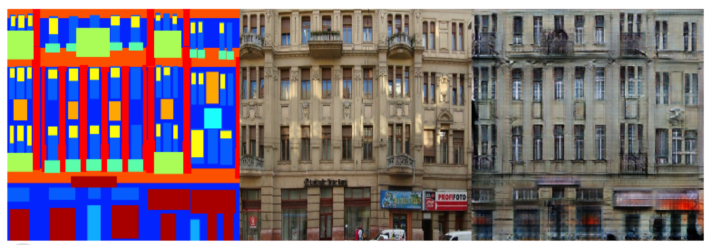
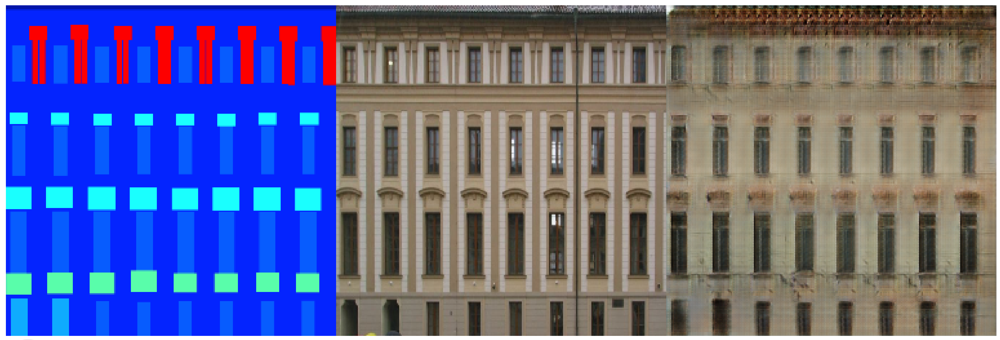
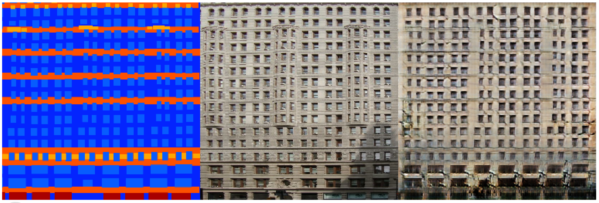
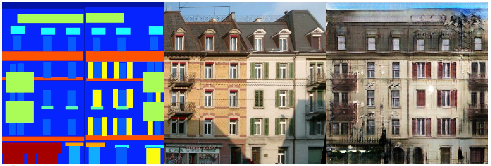
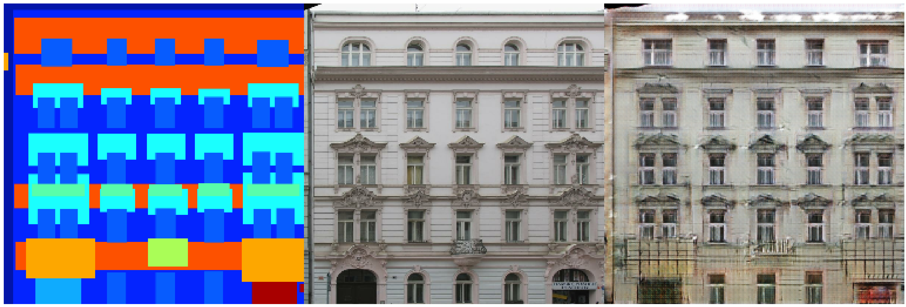
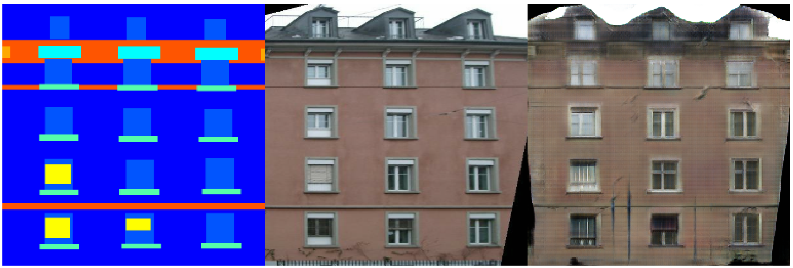
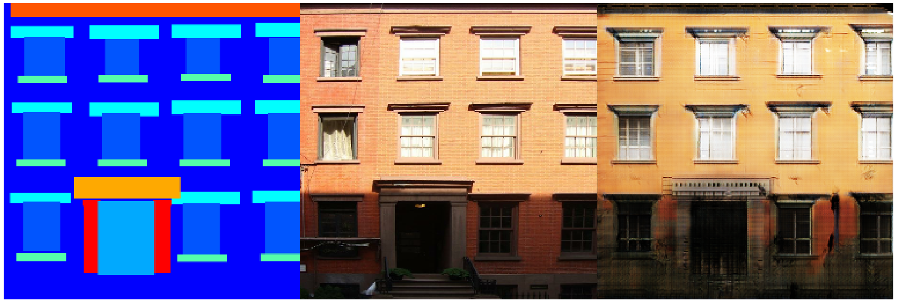

# Conditional Adversarial Networks (CAN)
This is an tensorflow implementation of [pix2pix](https://github.com/phillipi/pix2pix) based on ['image-to-image translation with conditional adversarial networks'](https://arxiv.org/pdf/1611.07004.pdf).

## Requirements
- Nvidia GPU and cuDNN 5.0
- Tensorflow 1.0.0

## Train
- Clone this repository
```
git clone https://github.com/fullfanta/pix2pix-tensorflow.git
```

- Download database
I borrowed download script from [pix2pix](https://github.com/phillipi/pix2pix).
```
$ cd pix2pix-tensorflow
$ sh datasets/download_datasets.sh facades
$ sh datasets/download_datasets.sh edges2handbags
$ sh datasets/download_datasets.sh edges2shoes
$ sh datasets/download_datasets.sh maps
```

- Train CAN with specific dataset.
```
$ python train.py --dataset=facades --which_direction=BtoA --batch_size=1 --device=gpu
```

I attatch two shell script to train facades(`train_facades.sh`) and edges2handbags(`train_edges2handbags.sh`).

- To see training procedure, you can start tensorboard.
```
$ tensorboard --logdir=result_facades
```

## Results
These are some results of facades: left - input, center - gt and right - generated image.








By modifying this code, I transformed facial expression from **neutral** to **smile** by using [MultiPIE](http://www.cs.cmu.edu/afs/cs/project/PIE/MultiPie/Multi-Pie/Home.html).

